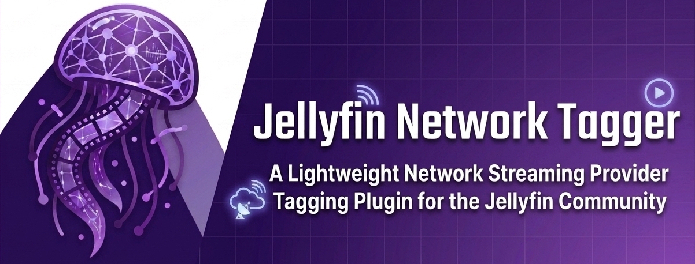
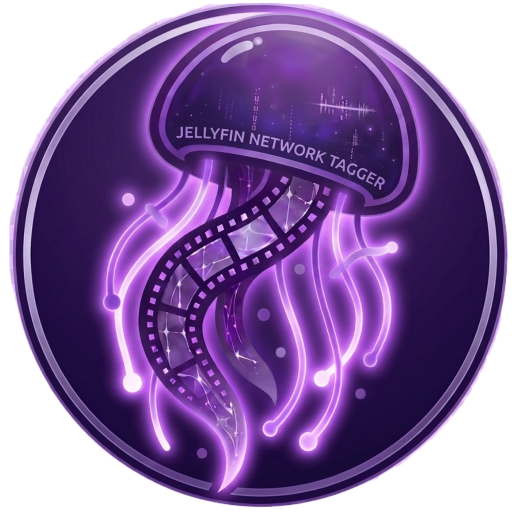
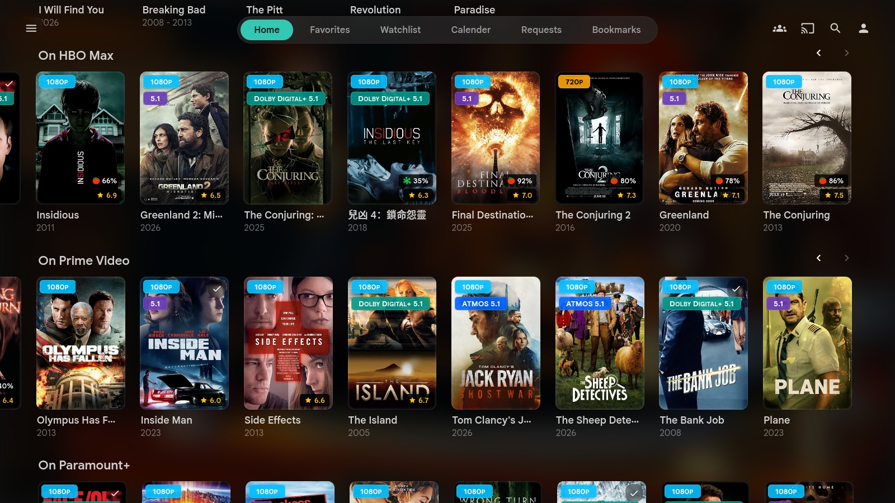
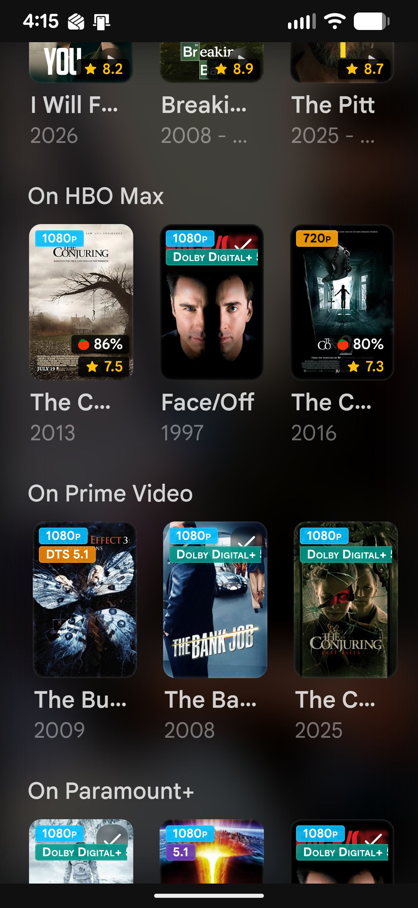
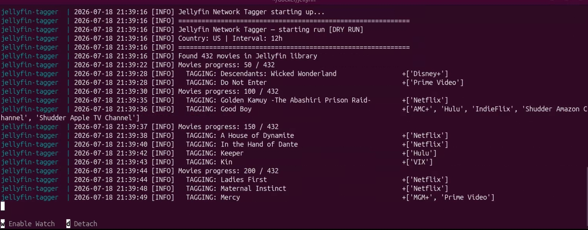

<p align="center">
  
</p>

<p align="center">
  
</p>

<h1 align="center">Jellyfin Network Tagger</h1>

<p align="center">
  
  
  
  
  
  
</p>

<p align="center">
  <a href="https://hub.docker.com/r/jhosted/jellyfin-network-tagger">
    
  </a>
  <a href="https://ghcr.io/jpwebdude/jellyfin-network-tagger">
    
  </a>
  <a href="https://github.com/jpwebdude/jellyfin-network-tagger/issues">
    
  </a>
  <a href="https://buymeacoffee.com/jpwebdude">
    
  </a>
</p>

A lightweight Python + Docker service that scans your [Jellyfin](https://jellyfin.org/) library, looks up each item on [TMDB](https://www.themoviedb.org/), and automatically adds clean, normalized streaming provider tags — Netflix, Max, Disney+, Prime Video, Apple TV+, Paramount+, Discovery+ and more.

These tags can then be used by plugins like **Auto Collections** [(github.com)](https://github.com/KeksBombe/jellyfin-plugin-auto-collections") or **SmartLists** [(github.com)](https://github.com/jyourstone/jellyfin-smartlists-plugin") to automatically build per‑network collections, and surfaced beautifully on your Jellyfin homepage with the **KefinTweaks** plugin [(github.com)](https://github.com/ranaldsgift/KefinTweaks").

</div>

---

## ✨ Features

+ Automatically tags Jellyfin items with streaming provider names

+ Non‑destructive updates — adds tags without overwriting existing metadata

+ Scheduled runs — configurable interval (default: every 24h)

+ GHCR + Docker Hub images

+ Detailed logging — dry‑run mode for safe testing

+ Integrates seamlessly with Jellyfin Auto Collections and SmartLists

---

## 📸 Screenshots

<p align="center">
<a href="docs/images/jellyfin-desktop-network-rows.jpg">

</a>
<a href="docs/images/jellyfin-mobile-network-rows.jpg">

</a>
</p>

## 🎥 Video Preview

(Click image below to view video)

<p align="center">
<a href="https://youtu.be/u2z-TYNpBhs?si=D5jFXIbt20CBf0gM">

</a>
</p>

## Prerequisites

Before deploying, make sure you have the following:

| Requirement                | Notes                                                                                                           |
| -------------------------- | --------------------------------------------------------------------------------------------------------------- |
| **Docker**                 | Docker Engine or Docker Desktop with Compose v2                                                                 |
| **Jellyfin Server**        | Versions 10.8+ to 10.11.11 running as a Docker container. Jellyfin Server v12 is not supported as of this time. |
| **Jellyfin API Key**       | Dashboard → API Keys → **+** (name it `tagger`)                                                                 |
| **TMDB Account**           | Free account at [themoviedb.org](https://www.themoviedb.org/)                                                   |
| **TMDB Read Access Token** | Settings → API → **Read Access Token** (the long `eyJ...` token)                                                |
| **IMDB Metadata**          | Your Jellyfin items must have IMDB IDs in their ProviderIds                                                     |

> ⚠️ **Important:** The TMDB Read Access Token (starts with `eyJ`) is required — *not* the short API key. Using the wrong one will cause all TMDB lookups to fail.

---

## 🧱 Installation

### Option A — Build Locally

Recommended if you want to customize or modify the network names in the (PROVIDER_NAME_MAP)  dictionary located in tagger.py 

```bash
git clone https://github.com/jpwebdude/jellyfin-network-tagger.git
cd jellyfin-network-tagger
```

Create your `.env` file first using the example found down further on this page:

Then build your image:

```bash
docker compose up --build jellyfin-network-tagger
```

```yaml
services:
  jellyfin-network-tagger:
    build: .
    container_name: jellyfin-network-tagger
    restart: unless-stopped
    env_file:
      - ./jellyfin-network-tagger/.env
    user: "1000:1000"
    networks:
      - media-stack_default

networks:
  media-stack_default:
    external: true
```

### Option B — Pull pre‑built image (recommended)

You can run the tagger using the pre‑built GHCR & Docker Hub images, but you **must** create a `.env` file first!

Without the required environment variables, the container cannot connect to Jellyfin or TMDB.

## 🧾 Environment Variables (`.env`)

Your `.env` file should look like:

```env
JELLYFIN_URL=http://192.168.x.x:8096
JELLYFIN_API_KEY=your-jellyfin-api-key
TMDB_API_KEY=eyJ...your-tmdb-read-access-token - Long version API Token
TMDB_COUNTRY=US
RUN_INTERVAL_HOURS=24
DRY_RUN=true

# Leave as is or add your own to the list
# Pro-tip - When you do your first dry run before going live it will list alot of network names that you will most likely want to add to this list.

IGNORE_PROVIDERS=Tubi TV,Pluto TV,Crackle,The Roku Channel,Kanopy,fuboTV,Philo
```

> ✔ Use your host’s LAN IP for Jellyfin
> ✔ Use the long TMDB Read Access Token (`eyJ...`)
> ✔ Start with `DRY_RUN=true` to preview changes safely

## 📦 GHCR (GitHub) image

Pull the image:

```bash
docker pull ghcr.io/jpwebdude/jellyfin-network-tagger:latest
```

Use GHCR in Docker Compose

```yaml
services:
  jellyfin-network-tagger:
    image: ghcr.io/jpwebdude/jellyfin-network-tagger:latest
    container_name: jellyfin-network-tagger
    restart: unless-stopped
    env_file:
      - ./jellyfin-network-tagger/.env
    user: "1000:1000"
    networks:
      - media-stack_default

networks:
  media-stack_default:
    external: true
```

## 📦 DockerHub image

```bash
docker pull jhosted/jellyfin-network-tagger:latest
```

Use Docker Hub in Docker Compose

```yaml
services:
  jellyfin-network-tagger:
    image: jhosted/jellyfin-network-tagger:latest
     container_name: jellyfin-network-tagger
    restart: unless-stopped
    env_file:
      - ./jellyfin-network-tagger/.env
    user: "1000:1000"
    networks:
      - media-stack_default

networks:
  media-stack_default:
    external: true
```

### 🧩 Docker Compose Examples

##### **Scenario 1 — Jellyfin running in** `network_mode: host`  **(MOST COMMON)**

If your Jellyfin container uses:

```yaml
network_mode: host
```

then **do NOT** try to place the tagger on the same network — host‑mode containers cannot join Docker networks.

Instead, simply point the tagger to your host’s LAN IP:

```yaml
services:
  jellyfin-network-tagger:
    image: ghcr.io/jpwebdude/jellyfin-network-tagger:latest
    container_name: jellyfin-network-tagger
    restart: unless-stopped
    env_file:
      - ./jellyfin-network-tagger/.env
   user: "1000:1000"

    # Jellyfin is running in host mode, so the tagger reaches it via LAN IP:
    # JELLYFIN_URL=http://192.168.x.x:8096

    networks:
      - media-stack_default   # Optional: only if your other apps use this network

networks:
  media-stack_default:
    external: true
```

```markdown
> ⚠️ **If your Jellyfin container uses `network_mode: host`, do NOT try to place the tagger on the same network.**
>
> Docker containers cannot join a host‑mode network.  
> Instead, set `JELLYFIN_URL` to your host machine’s LAN IP (e.g., `http://192.168.1.100:8096`).  
> The tagger will reach Jellyfin normally through the LAN.
```

---

#### Scenario 2 — Jellyfin running on a normal Docker network

If Jellyfin is on a bridge network (e.g., `media-stack_default`), then place the tagger on the same network:

```yaml
services:
  jellyfin-network-tagger:
    image: ghcr.io/jpwebdude/jellyfin-network-tagger:latest
    container_name: jellyfin-network-tagger
    restart: unless-stopped
    env_file:
      - ./jellyfin-network-tagger/.env
   user: "1000:1000"
    networks:
      - media-stack_default

networks:
  media-stack_default:
    external: true
```

**Find your Docker network name:**

```bash
docker network ls
# Look for a name ending in _default — usually yourfoldername_default
```

## First Run (Dry Run)

```bash
docker compose up jellyfin-network-tagger
```

#### **Watch the logs:**

```bash
docker logs -f jellyfin-network-tagger
```

You should see:

+ number of movies scanned

+ TMDB lookups

+ provider normalization

+ run summary

No tags will be written while `DRY_RUN=true`.

## 🚀 Go Live

Edit `.env`:

```yaml
DRY_RUN=false
```

Then restart:

```bash
docker compose restart jellyfin-network-tagger
```

---

## ⚙️ Configuration

All configuration is done through environment variables in your `.env` file.

| Variable             | Default      | Description                                                                                                                             |
| -------------------- | ------------ | --------------------------------------------------------------------------------------------------------------------------------------- |
| `JELLYFIN_URL`       | *(required)* | Full URL to your Jellyfin server. Use your host's LAN IP from inside Docker — **not** `localhost`. Example: `http://192.168.1.100:8096` |
| `JELLYFIN_API_KEY`   | *(required)* | Your Jellyfin API key from Dashboard → API Keys                                                                                         |
| `TMDB_API_KEY`       | *(required)* | TMDB Read Access Token (the long `eyJ...` one — not the short key)                                                                      |
| `TMDB_COUNTRY`       | `US`         | Two-letter country code for provider lookup                                                                                             |
| `RUN_INTERVAL_HOURS` | `24`         | How often to re-scan the library (hours)                                                                                                |
| `DRY_RUN`            | `false`      | Set to `true` to preview without writing any tags                                                                                       |
| `IGNORE_PROVIDERS`   | *(empty)*    | Comma-separated list of provider names to skip entirely                                                                                 |

Edit `.env` with your Jellyfin + TMDB credentials:

```env
JELLYFIN_URL=http://192.168.x.x:8096
JELLYFIN_API_KEY=your-jellyfin-api-key-here
TMDB_API_KEY=eyJ...your-tmdb-read-access-token-here
TMDB_COUNTRY=US
RUN_INTERVAL_HOURS=24
DRY_RUN=true
IGNORE_PROVIDERS=Tubi TV,Pluto TV,Crackle,The Roku Channel,Kanopy,fuboTV,Philo
```

---

## Provider Name Normalization

TMDB returns verbose provider names like `Netflix Standard with Ads` or `Paramount+ Roku Premium Channel`. The tagger collapses all variants into clean, consistent display names:

| Raw TMDB Name                         | Normalised Tag |
| ------------------------------------- | -------------- |
| Netflix basic/Standard with Ads       | `Netflix`      |
| Amazon Prime Video / with Ads         | `Prime Video`  |
| Apple TV / Apple TV Plus              | `Apple TV+`    |
| HBO Max / Max Amazon Channel          | `Max`          |
| Disney Plus / Disney+ Amazon Channel  | `Disney+`      |
| Peacock Premium / Premium Plus        | `Peacock`      |
| Paramount Plus / Paramount+ Essential | `Paramount+`   |
| Discovery Plus                        | `Discovery+`   |
| Showtime Amazon/Apple/Roku Channel    | `Showtime`     |
| STARZ / Starz Amazon Channel          | `Starz`        |
| MGM Plus / MGM+ Amazon Channel        | `MGM+`         |
| AMC+ Amazon/Apple/Roku Channel        | `AMC+`         |

> **If you see unmapped provider names appearing as tags, add them to the `PROVIDER_NAME_MAP` dictionary in `tagger.py`, rebuild the container, and restart.**

---

## Daily Operations

**Watch live logs**

```bash
docker logs -f jellyfin-network-tagger
```

**Trigger an immediate re-scan**

```bash
docker compose restart jellyfin-network-tagger
```

**Run in background (detached)**

```bash
docker compose up -d jellyfin-network-tagger
```

**Stop the tagger**

```bash
docker compose down jellyfin-network-tagger
```

**Change the run interval**

```bash
# Edit .env
RUN_INTERVAL_HOURS=24

# Then restart
docker compose restart jellyfin-network-tagger
```

## 📊 Example Run Summary

At the end of each run, the tagger prints a one-line summary:

```
Run complete: 42 tagged | 310 unchanged | 12 no-id | 3 no-tmdb | 8 no-providers | 0 errors
```

| Stat           | Meaning                                                   |
| -------------- | --------------------------------------------------------- |
| `tagged`       | Items that had new provider tags written successfully     |
| `unchanged`    | Items already tagged correctly — skipped                  |
| `no-id`        | Items with no IMDB ID in Jellyfin metadata — skipped      |
| `no-tmdb`      | IMDB ID not found in TMDB database — skipped              |
| `no-providers` | Found on TMDB but no streaming data for your country      |
| `errors`       | Failed to write back to Jellyfin — check logs for details |

---

## 🛠 Troubleshooting

+ **Jellyfin unreachable** → Jellyfin is in `network_mode: host`, use LAN IP

+ **TMDB lookups failing** → using short API key instead of long token

+ **No tags written** → DRY_RUN=true

+ **Network errors** → ensure `networks:` block is at root level

+ **Code changes not applying** → run a clean rebuild:

```bash
docker compose down jellyfin-network-tagger
docker rmi jellyfin-network-tagger
docker compose up -d --build jellyfin-network-tagger
```

+ **`invalid compose project` or network error** → The `networks:` block is nested under the service instead of at root level. Move it to zero indentation at the bottom of your `docker-compose.yml`.

+ **Provider names appearing unclean** → Add the raw name to `PROVIDER_NAME_MAP` in `tagger.py` mapping it to your preferred clean name, then rebuild.

---

## Recommended Jellyfin Plugins

The tagger works great alongside these Jellyfin plugins:

- [KeksBombe's - Auto Collections](https://github.com/KeksBombe/jellyfin-plugin-auto-collections) — automatically builds per-network collections from the tags this tool writes.
- [KefinTweaks](https://github.com/ranaldsgift/KefinTweaks) — surfaces those collections as rows on your Jellyfin homepage.
+ [Jellyfin SmartLists](https://github.com/jyourstone/jellyfin-smartlists-plugin)  — automatically builds per-network collections from the tags this tool writes.

---

## ❤️ Acknowledgements

This tool was built by a member of the Jellyfin community for the Jellyfin community.

Streaming provider data is sourced from [The Movie Database (TMDB)](https://www.themoviedb.org/). This product uses the TMDB API but is not endorsed or certified by TMDB.

---

## 🤝 Contributing

We welcome contributions, bug fixes, and feature requests! Because this plugin is built for the Jellyfin ecosystem, all contributions must adhere to open-source compliance.

## ⚖️ License & Anti-Commercial Policy

This project is licensed under the **GNU General Public License v3.0 (GPL-3.0)**. 

See the [LICENSE](LICENSE) file for the full legal text.

<p align="center">
  

</p>

<div align="center">
  <sub>Made with ❤️ for the self-hosting community</sub>
</div>
